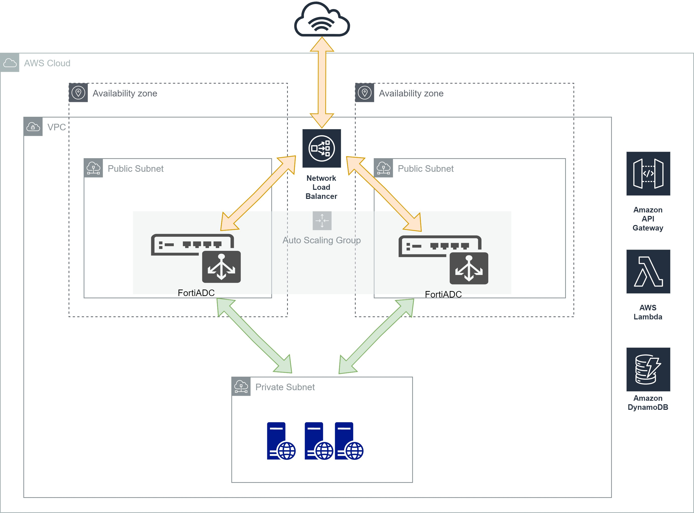

# quickstart-fortinet-fortiadc

## Fortinet FortiADC Auto Scaling Baseline on the AWS Cloud

This Quick Start deploys FortiADC Auto Scaling on the Amazon Web Services (AWS) Cloud in about 15 minutes.

FortiADC Application Delivery Controllers (ADC) provides application availability, web optimization, and application security (WAF). The FortiADC family of physical and virtual appliances delivers fast, secure and intelligent acceleration and distribution of demanding applications in the enterprise. FortiADC delivers fast, secure and intelligent acceleration for demanding application environments. FortiADC virtual machines offer the same features of the FortiADC hardware-based appliances and provide the flexibility to add or spin down system resources to match usage demands and help control costs in dynamic application environments.

This Quick Start deploys an automatically scaled group of FortiADC instances, which provide application availability, web optimization, and application security (WAF) to help protect your services from cyber attacks. The Quick Start uses AWS CloudFormation templates to build the AWS infrastructure and to deploy the FortiADCs to help protect your workloads.

The Quick Start offers two deployment options:

 - [Deploying FortiADC into a new virtual private cloud (VPC) on AWS](https://us-west-2.console.aws.amazon.com/cloudformation/home?region=us-west-2#/stacks/new?stackName=FortiadcASG&templateURL=https://aws-quickstart-fortiadc-autoscale.s3.us-west-2.amazonaws.com/quickstart-fortinet-Fortiadc/templates/workload-main.template)
 - [Deploying FortiADC into an existing VPC on AWS](https://us-west-2.console.aws.amazon.com/cloudformation/home?region=us-west-2#/stacks/new?stackName=FortiadcASG&templateURL=https://aws-quickstart-fortiadc-autoscale.s3.us-west-2.amazonaws.com/quickstart-fortinet-Fortiadc/templates/workload-main-with-VPC.template)

You can also use the AWS CloudFormation templates as a starting point for your own implementation.

For architectural details, step-by-step instructions, and customization options, see the [deployment guide](https://fwd.aws/xjzgv). 

To post feedback, submit feature ideas, or report bugs, use the **Issues** section of this GitHub repo. If you'd like to submit code for this Quick Start, please review the [AWS Quick Start Contributor's Kit](https://aws-quickstart.github.io/).
